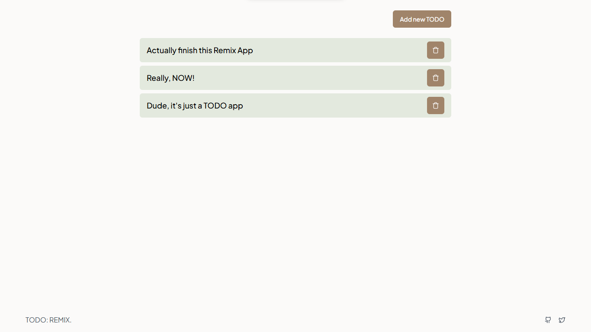

# TODO Remix

Learn Remix by making simple TODO app



## Development

- Copy the `.env.example` file to `.env`
- Replace the `DATABASE_URL` with your own database URL

Run these script in your terminal:

```shellscript
pnpm install
pnpm run dev
```

See the app working

## Deployment

First, build your app for production:

```sh
pnpm run build
```

Then run the app in production mode:

```sh
pnpm start
```
